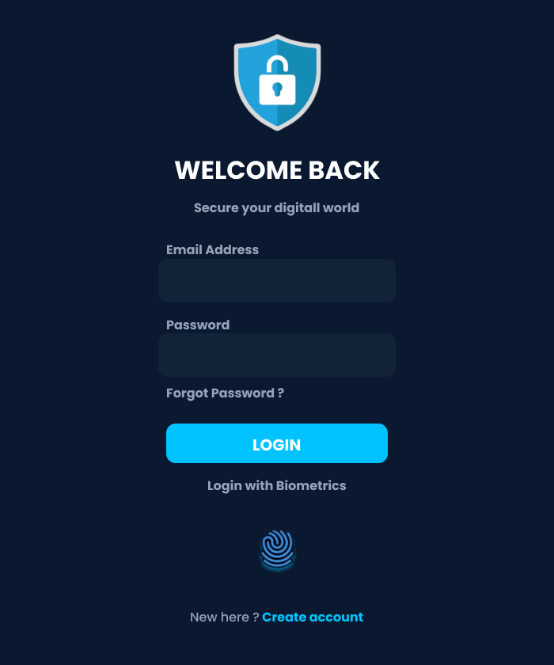
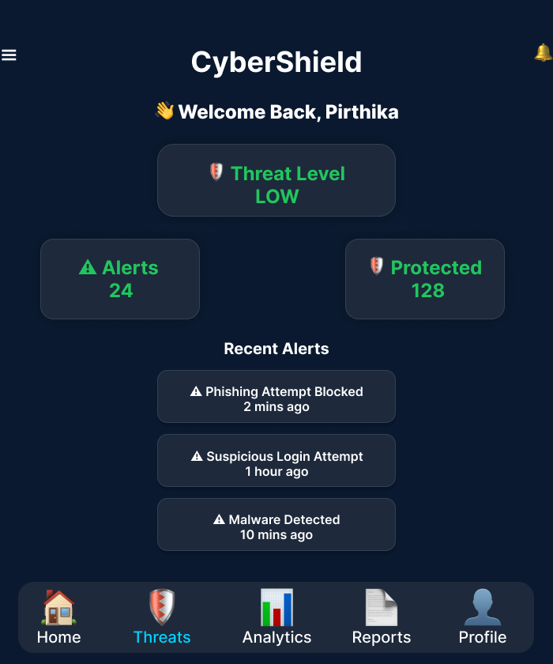
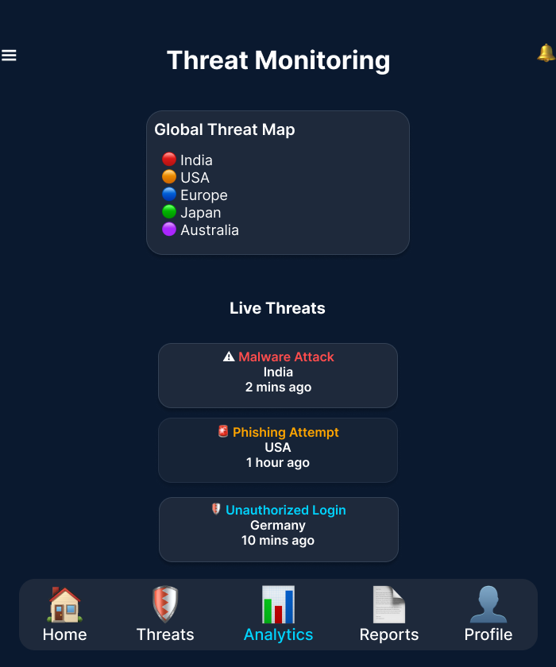
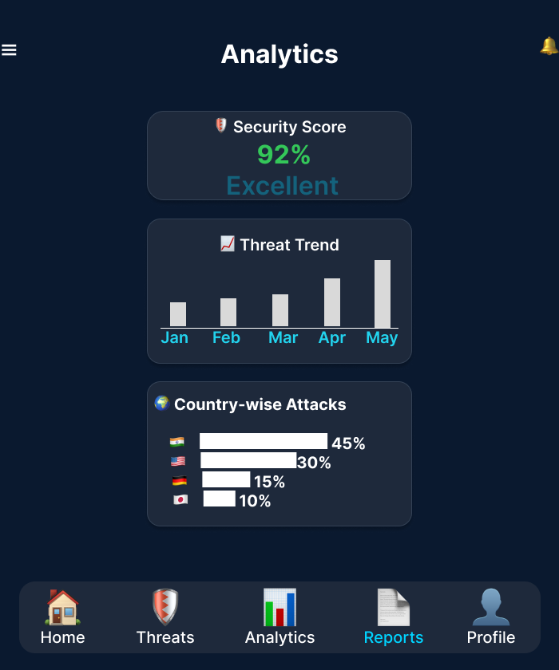
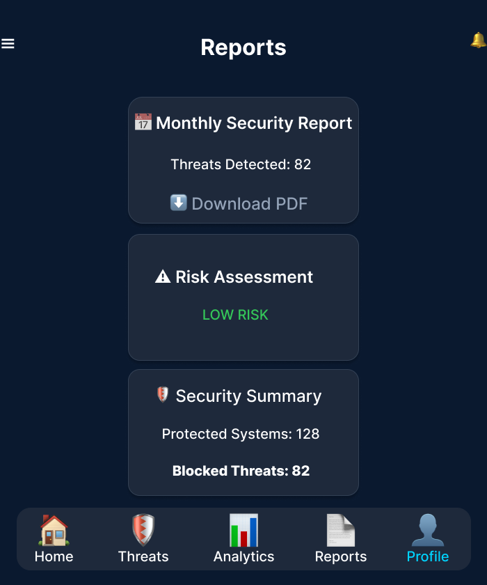

# 🛡 CyberShield – Cyber Security Awareness App UI Redesign

# Overview
CyberShield is a redesigned mobile application interface focused on cybersecurity awareness and threat monitoring.

# Features
- Animated Splash Screen
- Login Authentication UI
- Dashboard
- Threat Monitoring
- Analytics
- Reports
- Profile Screen
- Interactive Navigation

# Tools Used
- Figma
- UI/UX Design
- Prototype Animation

# Screens
- Splash
- Login
- Dashboard
- Threat Monitoring
- Analytics
- Reports
- Profile

# Screenshots

 

# Author
Pirthika
